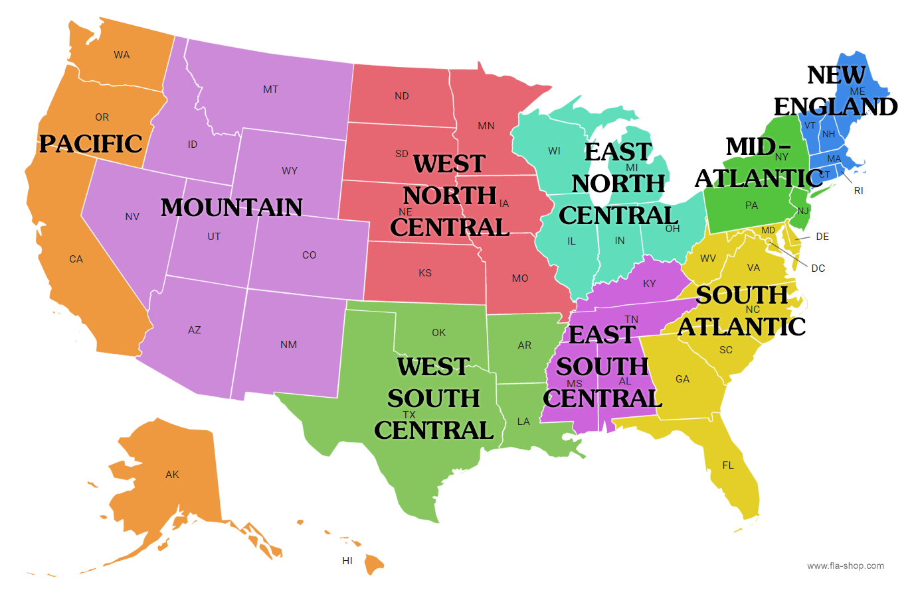

```{r setup, include=FALSE}
knitr::opts_chunk$set(echo = TRUE)
library(gssr)
library(gssrdoc)
library(ggplot2)
library(RColorBrewer)
library(dplyr)
```

## Years for each variable

```{r}
data(gss_all)
```

Region

```{r}
gss_which_years(gss_all, region)
gss_which_years(gss_all, sex)
gss_which_years(gss_all, race)
gss_which_years(gss_all, age)
gss_which_years(gss_all, educ)
gss_which_years(gss_all, income)

```

Polviews - Think of self as liberal or conservative

```{r}
gss_which_years(gss_all, polviews)
```

Religion - R's religious preference

```{r}
gss_which_years(gss_all, relig)
```

Looks like we're starting with 1974. Looking at region distribution in 74 and 18

```{r}
y74 <- gss_get_yr(1974)
y74_f <- y74[c('region', 'polviews', 'relig')]
y74_f$region <- factor(y74_f$region, levels = c(1, 2, 3, 4, 5, 6, 7, 8, 9), labels = c("new england", "middle atlantic", "east north central", "west north central", "south atlantic", "east south atlantic", "west south central", "mountain", "pacific"))
str(y74_f)
plot74 <- ggplot(y74_f, aes(x=region, color=region, fill=region)) + geom_histogram(stat="count") + labs(title = "Regions in 1974", x="Region")
plot74

y18 <- gss_get_yr(2018)
y18_f <- y18[c('region', 'polviews', 'relig')]
y18_f$region <- factor(y18_f$region, levels = c(1, 2, 3, 4, 5, 6, 7, 8, 9), labels = c("new england", "middle atlantic", "east north central", "west north central", "south atlantic", "east south atlantic", "west south central", "mountain", "pacific"))
str(y18_f)
#plot18 <- ggplot(y18_f, aes(x=region)) + geom_qq() + labs(title = "Regions in 2018", x="Region")
#plot18
```

```{r}
y74_f$polviews <- factor(y74_f$polviews, levels = c(1, 2, 3, 4, 5, 6, 7), labels = c("extremely liberal", "liberal", "slightly liberal", "moderate", "slightly conservative", "conservative", "extremely conservative"))

y18_f$polviews <- factor(y18_f$polviews, levels = c(1, 2, 3, 4, 5, 6, 7), labels = c("extremely liberal", "liberal", "slightly liberal", "moderate", "slightly conservative", "conservative", "extremely conservative"))

plot74 <- ggplot(y74_f, aes(x=polviews)) + geom_histogram(stat="count") + labs(title = "Political landscape in 1974", x="Political Lean")
plot74

plot18 <- ggplot(y18_f, aes(x=polviews)) + geom_histogram(stat="count") + labs(title = "Political Landscape in 2018", x="Political Lean")
plot18
```

```{r}
y74_f$relig <- factor(y74_f$relig, levels = c(1, 2, 3, 4, 5, 6, 7, 8, 9, 10, 11, 12, 13), labels = c("prot", "cath", "jewish", "none", "other", "bud", "hind", "eastern", "islam", "ortho", "chris", "native", "nonden"))

#y18_f$relig <- factor(y18_f$relig, levels = c(1, 2, 3, 4, 5, 6, 7, 8, 9, 10, 11, 12, 13))

y18_f$relig <- case_when(
  y18_f$relig == 1 ~ 'Protestant',
  y18_f$relig == 2 ~ 'Catholic',
  y18_f$relig == 3 ~ 'Jewish',
  y18_f$relig == 4 ~ 'None',
  y18_f$relig == 5 ~ 'Other',
  y18_f$relig == 6 ~ 'Other',
  y18_f$relig == 7 ~ 'Other',
  y18_f$relig == 8 ~ 'Other',
  y18_f$relig == 9 ~ 'Other',
  y18_f$relig == 10 ~ 'Christian',
  y18_f$relig == 11 ~ 'Christian',
  y18_f$relig == 12 ~ 'Other',
  y18_f$relig == 13 ~ 'Christian',
  TRUE ~ 'NA'
)

plot74 <- ggplot(y74_f, aes(x=relig)) + geom_histogram(stat="count") + labs(title = "Religion in 1974", x="Religion")
plot74

plot18 <- ggplot(y18_f, aes(x=relig)) + geom_histogram(stat="count") + labs(title = "Relogion in 2018", x="Religion")
plot18
```


y74 <- gss_get_yr(1974)


```{r}
vars <- c('X', 'year', 'id', 'sex', 'age', 'race', 'relig', 'educ', 'income', 'region', 'polviews')
gss_old <- read.csv("../Marissa/gss_old.csv")
gss_old <- gss_old[, vars]
gss_new <- read.csv("../Marissa/gss_new.csv")
gss_new <- gss_new[, vars]
```

```{r}
gss_combo <- rbind(gss_old, gss_new)
```

```{r}
#convert variables to factors with labels
gss_old$region <- factor(gss_old$region, levels = c(1, 2, 3, 4, 5, 6, 7, 8, 9), labels = c("new england", "middle atlantic", "east north central", "west north central", "south atlantic", "east south atlantic", "west south central", "mountain", "pacific"))

gss_new$region <- factor(gss_new$region, levels = c(1, 2, 3, 4, 5, 6, 7, 8, 9), labels = c("new england", "middle atlantic", "east north central", "west north central", "south atlantic", "east south atlantic", "west south central", "mountain", "pacific"))

#gss_old$polviews <- factor(gss_old$polviews, levels = c(1, 2, 3, 4, 5, 6, 7), labels = c("extremely liberal", "liberal", "slightly liberal", "moderate", "slightly conservative", "conservative", "extremely conservative"))

#gss_new$polviews <- factor(gss_new$polviews, levels = c(1, 2, 3, 4, 5, 6, 7), labels = c("extremely liberal", "liberal", "slightly liberal", "moderate", "slightly conservative", "conservative", "extremely conservative"))

names(which.max(table(gss_old$region)))
```
# Region (region)

### Description
Here is a map of the country devided into its regions



### Mean, Median, and Mode

`r names(which.max(table(gss_old$region)))` is the mode for region in the 70s. The most frequent region in the 20s is `r names(which.max(table(gss_new$region)))`
The least frequent region in the 70's is `r names(which.min(table(gss_old$region)))`. And the least frequent region in the 20s is `r names(which.min(table(gss_new$region)))`

### Distribution


# Religion (relig)

### Descrpition
There are several more religions listed in the newer surveys. We decided to combine the smaller religions into one bucket called "Other" in order to more closely resemble the older surveys. 

### Mean, Median, Mode
The most frequent religion in the early surveys is  `r names(which.max(table(gss_old$relig)))`. The most frequent religion in the recent surveys is `r names(which.max(table(gss_new$relig)))`.

### Distribuion

# Political Spectrum (polviews)

### Descrpition
For this variable, respondents list where they fall on the political spectrum between extreme conservative and extreme progressive. 

### Mean, Median, Mode
The average value for political placement in the early surveys is `r mean(gss_old$polviews)`. The average political placement in the recent surveys is `r mean(gss_new$polviews)`.

### Distribuion

