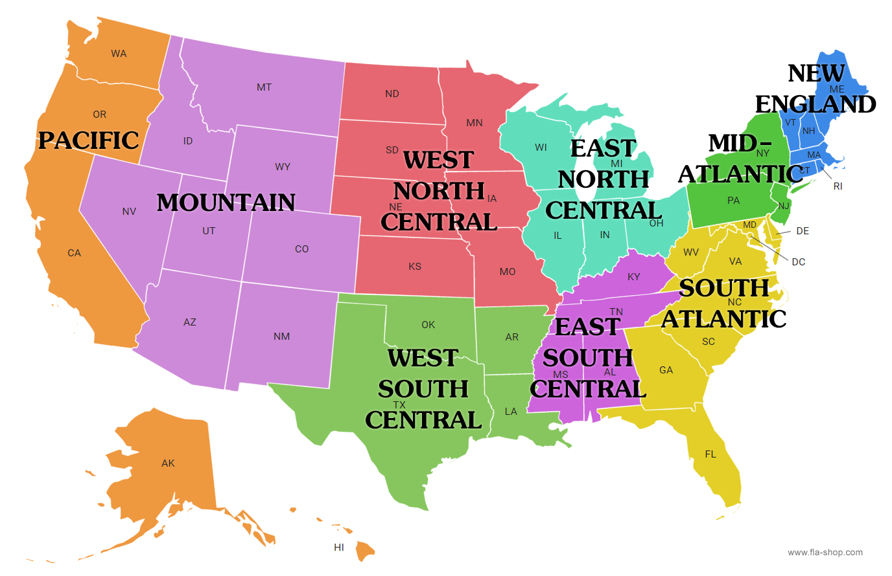

```{r setup, include=FALSE}
knitr::opts_chunk$set(warning = FALSE, echo = TRUE)
library(gssr)
library(gssrdoc)
library(ggplot2)
library(RColorBrewer)
library(dplyr)
library(ezids)
```

```{r}
#Read in data frames and filter down to the variables we want
vars1 <- c('X', 'year', 'id', 'sex', 'age', 'race', 'relig', 'educ', 'income', 'region', 'polviews', 'confed')
vars2 <- c('X', 'year', 'id', 'sex', 'age', 'race', 'relig', 'educ', 'income16', 'region', 'polviews', 'confed')
gss_old <- read.csv("../gss74_80.csv")
gss_old <- gss_old[, vars1]
gss_new <- read.csv("../gss16_22.csv")
gss_new <- gss_new[, vars2]
```

```{r}
#convert variables to factors with labels
gss_old$region <- factor(gss_old$region, levels = c(1, 2, 3, 4, 5, 6, 7, 8, 9), labels = c("new england", "middle atlantic", "east north central", "west north central", "south atlantic", "east south atlantic", "west south central", "mountain", "pacific"))

gss_new$region <- factor(gss_new$region, levels = c(1, 2, 3, 4, 5, 6, 7, 8, 9), labels = c("new england", "middle atlantic", "east north central", "west north central", "south atlantic", "east south atlantic", "west south central", "mountain", "pacific"))
```

```{r}
# Encoding variables
gss_new$relig <- case_when(
  gss_new$relig == 1 ~ 'Protestant',
  gss_new$relig == 2 ~ 'Catholic',
  gss_new$relig == 3 ~ 'Jewish',
  gss_new$relig == 4 ~ 'None',
  gss_new$relig == 5 ~ 'Other',
  gss_new$relig == 6 ~ 'Other',
  gss_new$relig == 7 ~ 'Other',
  gss_new$relig == 8 ~ 'Other',
  gss_new$relig == 9 ~ 'Other',
  gss_new$relig == 10 ~ 'Other',
  gss_new$relig == 11 ~ 'Other',
  gss_new$relig == 12 ~ 'Other',
  gss_new$relig == 13 ~ 'Other',
  TRUE ~ NA
)

gss_old$relig <- case_when(
  gss_old$relig == 1 ~ 'Protestant',
  gss_old$relig == 2 ~ 'Catholic',
  gss_old$relig == 3 ~ 'Jewish',
  gss_old$relig == 4 ~ 'None',
  gss_old$relig == 5 ~ 'Other',
  gss_old$relig == 6 ~ 'Other',
  gss_old$relig == 7 ~ 'Other',
  gss_old$relig == 8 ~ 'Other',
  gss_old$relig == 9 ~ 'Other',
  gss_old$relig == 10 ~ 'Other',
  gss_old$relig == 11 ~ 'Other',
  gss_old$relig == 12 ~ 'Other',
  gss_old$relig == 13 ~ 'Other',
  TRUE ~ NA
)

gss_new$income16 <- factor(gss_new$income16, levels = c(1:25), labels = c('Low','Low','Low','Low','Low','Low','Low','Low', 'Lower-Middle','Lower-Middle','Lower-Middle','Lower-Middle','Lower-Middle','Lower-Middle','Lower-Middle', 'Middle','Middle','Middle','Middle','Middle', 'Upper-Middle','Upper-Middle', 'High', 'High', 'High'))
```

# Region (region)

### Description

Here is a map of the country divided into its regions



### Distribution

```{r, echo=FALSE}
#Plot histograms
ggplot(gss_old, aes(x=region, color=region, fill=region)) + geom_histogram(stat="count") + labs(title = "Region 1974-1980", x="Region")
ggplot(gss_new, aes(x=region, color=region, fill=region)) + geom_histogram(stat="count") + labs(title = "Region 2016-2022", x="Region")
```

### Summary

The most frequent region in the 70s is `r names(which.max(table(gss_old$region)))`. The most frequent region in the 20s is `r names(which.max(table(gss_new$region)))`. The least frequent region in the 70's is `r names(which.min(table(gss_old$region)))`. And the least frequent region in the 20s is `r names(which.min(table(gss_new$region)))`.

### Hypothesis Test (1974-1980)

```{r}
pol_data <- gss_old[, c('region', 'confed')]
pol_data <- pol_data[complete.cases(pol_data),]

rel_new <- chisq.test(pol_data$region, pol_data$confed)
rel_new
rel_new$observed
```

### Hypothesis Test (2016-2022)

```{r}
pol_data <- gss_new[, c('region', 'confed')]
pol_data <- pol_data[complete.cases(pol_data),]

rel_new <- chisq.test(pol_data$region, pol_data$confed)
rel_new
rel_new$observed
```

### Conclusion

The p-value for the chi-square test of the older time interval indicates that there was a significant relationship between which region a respondent lived in and how they felt about the executive branch. We can neglect the null hypothesis that there is no statistical significance there. However, that is not the case for the more recent time interval. The p-value is greater than 0.05 which means we cannot reject the null hypothesis for the years 2016 through 2022.

------------------------------------------------------------------------

# Religion (relig)

### Description

There are several more religions listed in the newer surveys. We decided to combine the less frequent religions into one bucket called "Other" in order to more closely resemble the older surveys.

### Distribution

```{r}
ggplot(gss_old, aes(x=relig, color=relig, fill=relig)) + geom_histogram(stat="count") + labs(title = "Religion 1974-1980", x="Religion")
ggplot(gss_new, aes(x=relig, color=relig, fill=relig)) + geom_histogram(stat="count") + labs(title = "Religion 2016-2022", x="Religion")
```

### Summary

The most frequent religion in the early surveys is `r names(which.max(table(gss_old$relig)))`. The most frequent religion in the recent surveys is `r names(which.max(table(gss_new$relig)))`. While protestant is the most common religion for both time intervals, we see an increase to all other religions in the recent surveys.

### Hypothesis Test (1974 - 1980)

```{r}
pol_data <- gss_old[, c('relig', 'confed')]
pol_data <- pol_data[complete.cases(pol_data),]

rel_old <- chisq.test(pol_data$relig, pol_data$confed)
rel_old
rel_old$observed
```

### Hypothesis Test (2016 - 2022)

```{r}
pol_data <- gss_new[, c('relig', 'confed')]
pol_data <- pol_data[complete.cases(pol_data),]

rel_new <- chisq.test(pol_data$relig, pol_data$confed)
rel_new
rel_new$observed
```

### Conclusion

As a result of our hypothesis tests for religion, we can reject the null hypothesis and claim that there is a significant relationship between a respondent's religion and how they feel about our executive branch.

------------------------------------------------------------------------

# Political Spectrum (polviews)

### Descrpition

For this variable, respondents give a number between 1 and 7 according to where they fall on the political spectrum with 1 being extremely progressive and 7 being extremely conservative.

### Distribuion

```{r, echo=FALSE}
ggplot(gss_old, aes(x=polviews)) + geom_histogram(stat="count", show.legend = F) + labs(title = "Polviews 2016-2022", x="Political Lean")

            
ggplot(gss_new, aes(x=polviews, fill='red')) + geom_histogram(stat="count", show.legend = F) + labs(title = "Polviews 2016-2022", x="Political Lean")
```

### Summary

The average value for political placement in the older surveys is `r mean(gss_old$polviews, na.rm=T)`. The average political placement in the recent surveys is `r mean(gss_new$polviews, na.rm=T)`. While the vast majority of respondents identified as moderate in both time intervals, the size of each extreme group grew substantially. This indicates a much more polarized political landscape in recent years which might account for the growth in negative sentiment towards the government.

### Hypothesis testing (1974 - 1980)

```{r}
pol_data <- gss_old[, c('polviews', 'confed')]
pol_data <- pol_data[complete.cases(pol_data),]

rel_old <- chisq.test(pol_data$polviews, pol_data$confed)
rel_old
rel_old$observed
```

### Hypothesis testing (2016 - 2022)

```{r}
pol_data <- gss_new[, c('polviews', 'confed')]
pol_data <- pol_data[complete.cases(pol_data),]

rel_old <- chisq.test(pol_data$polviews, pol_data$confed)
rel_old
rel_old$observed
```

### Conclusion

From our chi-squared tests here, both p-values indicate a significant relationship between how a respondent identifies and how they feel about the executive branch of the government.
