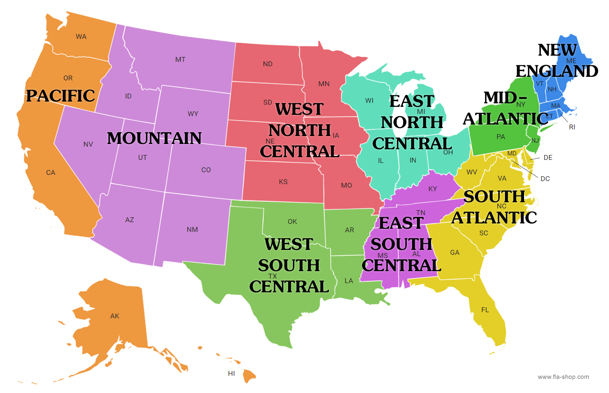

```{r, echo=FALSE, result='hide'}
knitr::opts_chunk$set(warning = FALSE, echo = TRUE)
library(kableExtra)
library(gssr)
library(gssrdoc)
library(ggplot2)
library(RColorBrewer)
library(knitr)
library(ezids)
library(RColorBrewer)


gss74 <- gss_get_yr(1974)
gss75 <- gss_get_yr(1975)
gss76 <- gss_get_yr(1976)
gss77 <- gss_get_yr(1977)
gss78 <- gss_get_yr(1978)
gss80 <- gss_get_yr(1980)

gss16 <- gss_get_yr(2016)
gss18 <- gss_get_yr(2018)
gss21 <- gss_get_yr(2021)
gss22 <- gss_get_yr(2022)
```

```{r, echo=FALSE}

common_74_80 <- Reduce(intersect, list(colnames(gss74), colnames(gss75), colnames(gss76), colnames(gss77), colnames(gss78), colnames(gss80)))

common_16_22 <- Reduce(intersect, list(colnames(gss16), colnames(gss18), colnames(gss21), colnames(gss22)))                       

gss74_80 <- rbind(gss74 [common_74_80], gss75 [common_74_80], gss76 [common_74_80], gss77 [common_74_80], gss78 [common_74_80], gss80 [common_74_80])

gss16_22 <- rbind(gss16 [common_16_22], gss18 [common_16_22], gss21 [common_16_22], gss22 [common_16_22])

#New datasets
gss74_80

gss16_22 

```

# Research Question and Background 

This study seeks to explore how demographic factors, such as sex, race, age, education level, income, geographic region, political views, and religion, have affected confidence in the Executive Branch of the Federal Government when comparing data from 1974 through 1980 to data from 2016 through 2022. Through examining the shifts in public trust across these demographic groups, we aim to uncover patterns that reflect broader societal changes and their impact on perceptions of government leadership. Specifically, the study looks at how these factors have contributed to either an increase or decline in confidence over time.

The period from 1974 through 1980 was marked by significant national events, such as the Watergate scandal, the aftermath of the Vietnam War, and economic challenges like inflation and unemployment, all of which likely influenced public trust in the government. In contrast, the 2016 through 2022 period saw increasing distrust in presidential candidates, the government's handling of the COVID-19 pandemic, and the rise of social justice movements like Black Lives Matter. These events provide a crucial backdrop for understanding the erosion of confidence in the Executive Branch across key demographics, as each period faced distinct political, social, and economic challenges that shaped public perceptions of leadership and governance.


# Confidence in the Executive Branch of the Federal Government (Confed)

The original coding for confidence in the executive branch ranged from 1 to 3, representing "A Great Deal," "Only Some," and "Hardly Any," respectively. This was recoded by directly assigning these descriptive labels to the numeric values. The purpose of this recode was to improve clarity and readability when analyzing the data, making the results more interpretable without needing to reference a codebook. This change ensures consistency across the time periods and facilitates easier comparison of responses.

## EDA of Confed

In the dataset from 1974 through 1980, the most frequent response regarding confidence in the executive branch of the government (confed) is `r names(which.max(table(gss74_80$confed)))`, while the most frequent response from 2016 through 2022 is `r names(which.max(table(gss16_22$confed)))`. The least frequent response in 1974 through 1980 is `r names(which.min(table(gss74_80$confed)))`, and the least frequent response in 2016 through 2022 is `r names(which.min(table(gss16_22$confed)))`.

Regarding missing data, there are `r sum(is.na(gss74_80$confed))` missing values for the confed variable in the 1974–1980 data and `r sum(is.na(gss16_22$confed))` missing values in the 2016–2022 data.

## EDA of Confidence in the Executive Branch (1974–1980)

```{r, echo=FALSE, results='hide'}
gss74_80$confed <- factor(gss74_80$confed, 
                          levels = c(1, 2, 3), 
                          labels = c("A Great Deal", "Only Some", "Hardly Any"))
```

```{r, echo=FALSE}

ggplot(data = gss74_80, aes(x = confed, fill = confed)) + 
  geom_bar() + 
  scale_fill_brewer(palette = "Set3") +  
  labs(x = "Confidence in Executive Branch", 
       y = "Frequency", 
       title = "Confidence in Executive Branch (1974-1980)")
```

## EDA of Confidence in the Executive Branch (2016–2022)


```{r, echo=FALSE, results='hide'}
gss16_22$confed <- factor(gss16_22$confed, 
                          levels = c(1, 2, 3), 
                          labels = c("A Great Deal", "Only Some", "Hardly Any"))
```

```{r, echo=FALSE}


ggplot(data=gss16_22, aes(x = confed, color=confed, fill=confed)) + 
  geom_bar() + 
  scale_fill_brewer(palette = "Set3") + 
  labs(x= "Confidence in Executive Branch", y= "Frequency", title = "Confidence in Executive Branch (2016-2022)")
```

## Conclusion

The comparison of confidence in the executive branch between 1974-1980 and 2016-2022 reveals a significant shift in public trust over time. In the 1974-1980 period, the majority of respondents (represented by the mode) reported "Only Some" confidence in the executive branch, with 8,721 valid responses and only 282 missing data points. By contrast, in the 2016-2022 period, there was a notable increase in skepticism, with "Hardly Any" confidence becoming the most common response (mode), despite 4,551 missing responses out of 13,396 total. The visualized data shows a stark rise in "Hardly Any" confidence, reflecting an erosion of trust in the government over time. While the earlier period showed a relatively moderate level of trust, the later period reflects a growing disillusionment, as fewer people express strong confidence in the executive branch.


----------------------------------------------


# Region

Region remained the same: 1 = "New England", 2 = "Middle Atlantic", 3 = "East North Central", 4 = "West North Central", 5 = "South Atlantic", 6 = "East South Central", 7 = "West South Central", 8 = "Mountain", and 9 = "Pacific".

Additionally, here is a map of the country divided into its regions for reference.




## EDA of Regions

From 1974 through 1980, the most common region reported is `r names(which.max(table(gss74_80$region)))`, while from 2016 through 2022, the most common region is `r names(which.max(table(gss16_22$region)))`. The least common region between 1974 and 1980 is `r names(which.min(table(gss74_80$region)))`, and the least common region between 2016 and 2022 is `r names(which.min(table(gss16_22$region)))`.

For missing data, there are `r sum(is.na(gss74_80$region))` missing values in the 1974–1980 dataset and `r sum(is.na(gss16_22$region))` missing values in the 2016–2022 dataset.


## EDA of Region (1974–1980)


```{r, echo=FALSE, results='hide'}
gss74_80$region <- factor(gss74_80$region, levels = c(1, 2, 3, 4, 5, 6, 7, 8, 9), labels = c("new england", "middle atlantic", "east north central", "west north central", "south atlantic", "east south atlantic", "west south central", "mountain", "pacific"))
```

```{r, echo=FALSE}
xkablesummary(gss74_80[, c("region")])


ggplot(data=gss74_80, aes(x = region, color=region, fill=region)) + 
  geom_bar() + 
  scale_fill_brewer(palette = "Set3") +
  labs(x= "Region", y= "Frequency", title = "Region Distribution (1974-1980)")
```


## EDA of Region (2016–2022)


```{r, echo=FALSE, results='hide'}

gss16_22$region <- factor(gss16_22$region, levels = c(1, 2, 3, 4, 5, 6, 7, 8, 9), labels = c("new england", "middle atlantic", "east north central", "west north central", "south atlantic", "east south atlantic", "west south central", "mountain", "pacific"))
```

```{r, echo=FALSE} 

xkablesummary(gss16_22[, c("region")])


ggplot(data=gss16_22, aes(x = region, color=region, fill=region)) + 
  geom_bar() + 
  scale_fill_brewer(palette = "Set3") +
  labs(x= "Region", y= "Frequency", title = "Region Distribution (2016-2022)")
```

## Chi-Square Test: Confidence in Executive Branch vs Region

### Null Hypothesis:
There is no association between region and confidence in the executive branch.

### Alternative Hypothesis:
There is an association between region and confidence in the executive branch.

## Chi-Square Test (1974–1980)

```{r, echo=FALSE}
pol_data <- gss74_80[, c('region', 'confed')]
pol_data <- pol_data[complete.cases(pol_data),]

rel_new <- chisq.test(pol_data$region, pol_data$confed)
rel_new
rel_new$observed
```

## Chi-Square Test (2016–2022)

```{r,echo=FALSE}
pol_data <- gss16_22[, c('region', 'confed')]
pol_data <- pol_data[complete.cases(pol_data),]

rel_new <- chisq.test(pol_data$region, pol_data$confed)
rel_new
rel_new$observed
```

## Conclusion

The p-value for the chi-square test of the older time interval indicates that there was a significant relationship between which region a respondent lived in and how they felt about the executive branch. We can neglect the null hypothesis that there is no statistical significance there. However, that is not the case for the more recent time interval. The p-value is greater than 0.05 which means we cannot reject the null hypothesis for the years 2016 through 2022.

----------------------------------

# Age
Age has been categorized for convenience into the following groups: under 25, 25–45, 45–65, and 65+.

## EDA of Respondent's Age

The most frequent age reported in the dataset from 1974 to 1980 is `r names(which.max(table(gss74_80$age)))`, while the most frequent age from 2016 to 2022 is `r names(which.max(table(gss16_22$age)))`. The least frequent age in the 1974–1980 period is `r names(which.min(table(gss74_80$age)))`, and in the 2016–2022 period, it is `r names(which.min(table(gss16_22$age)))`.

Missing data for age: there are `r sum(is.na(gss74_80$age))` missing values in the 1974–1980 data and `r sum(is.na(gss16_22$age))` missing values in the 2016–2022 data. The age distribution shifted from a mean of 44.64 years in 1974-1980 to 49.71 years in 2016-2022, reflecting an older respondent population over time, likely due to demographic changes such as aging and increased life expectancy.

## EDA of Age (1974–1980)

```{r, echo=FALSE, results='hide'}
gss74_80$age <- as.numeric(gss74_80$age)

gss74_80$age <- factor(cut(gss74_80$age, 
                                 breaks = c(18, 24, 34, 44, 54, 64, 74, 84, 88, 100), 
                                 labels = c('18-24', '25-34', '35-44', '45-54', '55-64', '65-74', '75-84', '85-88', '89 or older')), 
                             levels = c('18-24', '25-34', '35-44', '45-54', '55-64', '65-74', '75-84', '85-88', '89 or older'), 
                             ordered = TRUE)
```

```{r, echo=FALSE}
xkablesummary(gss74_80[, c("age")])

ggplot(data = gss74_80, aes(x = age, fill = age)) +  
  geom_bar() + 
  scale_fill_brewer(palette = "Set3") + 
  labs(x = "Age Group", y = "Frequency", title = "Age Distribution (1974-1980)")
```

## EDA of Age (2016–2022)

```{r, echo=FALSE, results='hide'}
gss16_22$age <- as.numeric(gss16_22$age)

xkablesummary(gss16_22[, c("age")])

gss16_22$age <- factor(cut(gss16_22$age, 
                                 breaks = c(18, 24, 34, 44, 54, 64, 74, 84, 88, 100), 
                                 labels = c('18-24', '25-34', '35-44', '45-54', '55-64', '65-74', '75-84', '85-88', '89 or older')), 
                             levels = c('18-24', '25-34', '35-44', '45-54', '55-64', '65-74', '75-84', '85-88', '89 or older'), 
                             ordered = TRUE)
```


```{r, echo=FALSE}
xkablesummary(gss16_22[, c("age")])

ggplot(data = gss16_22, aes(x = age, fill = age)) +  
  geom_bar() + 
  scale_fill_brewer(palette = "Set3") + 
  labs(x = "Age Group", y = "Frequency", title = "Age Distribution (2016-2022)")
```


## Chi-Square Test: Confidence in Executive Branch vs Age

### Null Hypothesis:
There is no association between age and confidence in the executive branch.

### Alternative Hypothesis:
There is an association between age and confidence in the executive branch.

## Chi-Square Test (1974–1980)

```{r, echo=FALSE}
confed_age_table_74_80 <- table(gss74_80$confed, gss74_80$age)
chisq_test_result <- chisq.test(confed_age_table_74_80)
confed_age_table_74_80
```

## Chi-Square Test (2016–2022)

```{r, echo=FALSE}
confed_age_table_16_22 <- table(gss16_22$confed, gss16_22$age)
chisq_test_result <- chisq.test(confed_age_table_16_22)
confed_age_table_16_22
```

## Conclusion

Between 1974 and 1980, confidence in the executive branch varied by age, with 55% of respondents across all age groups reporting "Only Some" confidence. Older individuals (65+) showed greater trust, with nearly 19.5% expressing "A Great Deal" of confidence, while younger respondents, particularly those under 25, were more skeptical. This increase in trust with age may reflect older generations’ identification with traditional authority and established institutions.

However, by 2016-2022, a significant decline in trust was evident across all age groups. Around 45% of respondents expressed "Hardly Any" confidence, signaling a general erosion of trust in the executive branch. Even older individuals (65+), who previously showed higher levels of confidence, saw 46% expressing "Hardly Any" confidence, highlighting a breakdown in trust that now spans generations.

-----------------------------------------------


# Sex

The sex variable was originally coded as 1 for "Male" and 2 for "Female." 

## EDA of Sex

From 1974 to 1980, the most frequent sex reported is `r names(which.max(table(gss74_80$sex)))`, while the most frequent sex from 2016 to 2022 is `r names(which.max(table(gss16_22$sex)))`. The least frequent sex in both periods is `r names(which.min(table(gss74_80$sex)))` and `r names(which.min(table(gss16_22$sex)))`, respectively. Additionally, the number of missing values for sex in 1974–1980 is `r sum(is.na(gss74_80$sex))`, and in 2016–2022, it is `r sum(is.na(gss16_22$sex))`. The sex distribution of respondents in both time periods shows a higher proportion of female respondents. In the 1974-1980 dataset, there are no missing values, while in the 2016-2022 dataset, 115 responses are missing, but "Female" remains the mode in both periods.

## EDA of Sex (1974–1980)

```{r, echo=FALSE, results='hide'}
gss74_80$sex <- factor(gss74_80$sex, levels = c(1, 2), labels = c("Male", "Female"))
```

```{r, echo=FALSE}

ggplot(data=gss74_80, aes(x = sex, fill=sex)) + 
  geom_bar() + 
  scale_fill_brewer(palette = "Set3") +
  labs(x= "Sex", y= "Frequency", title = "Sex Distribution (1974-1980)")
```

## EDA of Sex (2016–2022)
```{r, echo=FALSE, results='hide'}
gss16_22$sex <- factor(gss16_22$sex, levels = c(1, 2), labels = c("Male", "Female"))
```

```{r, echo=FALSE}

ggplot(data=gss16_22, aes(x = sex, fill=sex)) + 
  geom_bar() + 
  scale_fill_brewer(palette = "Set3") +
  labs(x= "Sex", y= "Frequency", title = "Sex Distribution (2016-2022)")
```

## Chi-Square Test: Confidence in Executive Branch vs Sex

### Null Hypothesis:
There is no association between sex and confidence in the executive branch.

### Alternative Hypothesis:
There is an association between sex and confidence in the executive branch.

## Chi-Square Test (1974–1980)

```{r, echo=FALSE}
confed_sex_table_74_80 <- table(gss74_80$confed, gss74_80$sex)
chisq.test(confed_sex_table_74_80)
confed_sex_table_74_80
```

## Chi-Square Test (2016–2022)

```{r, echo=FALSE}
confed_sex_table_16_22 <- table(gss16_22$confed, gss16_22$sex)
chisq.test(confed_sex_table_16_22)
confed_sex_table_16_22
```

## Conclusion

The Chi-squared test for the relationship between confidence in the executive branch (confed) and sex shows statistically significant differences between men and women in both time periods, with p-values of 1.596e-06 (1974-1980) and 2.134e-05 (2016-2022). In the 1974-1980 dataset, a majority of respondents reported "Only Some" confidence, with 51.90% of men and 57.44% of women falling into this category. Similarly, in 2016-2022, trust had declined further, with "Hardly Any" confidence surging to 46.92% for men and 43.03% for women. However, despite the statistical significance, men consistently expressed slightly more confidence than women.

Given the large number of respondents in both time periods (8,721 in 1974-1980 and 8,765 in 2016-2022), there is a possibility that the test is detecting statistically significant results even though there might not be a meaningful real-world relationship between gender and confidence. This reflects the risk of Type I error, where the null hypothesis is incorrectly rejected due to the large sample size amplifying small differences, even if they are not practically significant. Therefore, while the test indicates a significant relationship, the effect size may be too small to suggest a strong or meaningful connection between sex and confidence in the executive branch.

-----------------------------------------


# Religion

The religion variable was originally coded with more categories, including specific denominations and smaller religious groups. In the recoded version, less common religions were collapsed into a single "Other" category, while major religions such as "Protestant," "Catholic," "Jewish," and "None" retained their specific labels. This recode simplifies the analysis by reducing the number of categories, ensuring comparability across time periods, and focusing on the most frequently represented groups. The change enhances the clarity of religious affiliation trends.

## EDA of Religion

In 1974–1980, the most common religious affiliation is `r names(which.max(table(gss74_80$relig)))`, while in 2016–2022, the most common affiliation is `r names(which.max(table(gss16_22$relig)))`. The least frequent religious affiliation in 1974–1980 is `r names(which.min(table(gss74_80$relig)))`, and in 2016–2022, it is `r names(which.min(table(gss16_22$relig)))`. While protestant is the most common religion for both time intervals, we see an increase to all other religions in the recent surveys.

There are `r sum(is.na(gss74_80$relig))` missing values in the 1974–1980 data and `r sum(is.na(gss16_22$relig))` missing values in the 2016–2022 data.

## EDA of Religion (1974–1980)

```{r, echo=FALSE, results='hide'}
gss74_80$relig <- factor(gss74_80$relig, levels = c(1:13), labels = c('Protestant', 'Catholic', 'Jewish', 'None', 'Other', 'Other', 'Other', 'Other', 'Other', 'Other', 'Other', 'Other', 'Other'))
```

```{r, echo=FALSE}
xkablesummary(gss74_80[, c("relig")])

ggplot(data=gss74_80, aes(x = relig, fill=relig)) + 
  geom_bar() + 
  scale_fill_brewer(palette = "Set3") +
  labs(x= "Religion", y= "Frequency", title = "Religion Distribution (1974-1980)")
```

## EDA of Religion (2016–2022)

```{r, echo=FALSE, results='hide'}
gss16_22$relig <- factor(gss16_22$relig, levels = c(1:13), labels = c('Protestant', 'Catholic', 'Jewish', 'None', 'Other', 'Other', 'Other', 'Other', 'Other', 'Other', 'Other', 'Other', 'Other'))
```

```{r, echo=FALSE}
xkablesummary(gss16_22[, c("relig")])


ggplot(data=gss16_22, aes(x = relig, fill=relig)) + 
  geom_bar() + 
  scale_fill_brewer(palette = "Set3") +
  labs(x= "Religion", y= "Frequency", title = "Religion Distribution (2016-2022)")
```

## Chi-Square Test: Confidence in Executive Branch vs Religion

### Null Hypothesis:
There is no association between religion and confidence in the executive branch.

### Alternative Hypothesis:
There is an association between religion and confidence in the executive branch.

## Chi-Square Test (1974–1980)

```{r, echo=FALSE}
pol_data <- gss74_80[, c('relig', 'confed')]
pol_data <- pol_data[complete.cases(pol_data),]

rel_old <- chisq.test(pol_data$relig, pol_data$confed)
rel_old
rel_old$observed
```

## Chi-Square Test (2016–2022)

```{r, echo=FALSE}
pol_data <- gss16_22[, c('relig', 'confed')]
pol_data <- pol_data[complete.cases(pol_data),]

rel_new <- chisq.test(pol_data$relig, pol_data$confed)
rel_new
rel_new$observed
```

## Conclusion

As a result of our hypothesis tests for religion, we can reject the null hypothesis and claim that there is a significant relationship between a respondent's religion and how they feel about our executive branch.


-------------------------


# Education

Education was origionally coded as a numaric variable of the amount of years the respondent had completed. However, we recoded it into High School or Less, Some College, and Graduate for a cleaner and more consice analysis. 

## EDA of Education

From 1974 to 1980, the most common education level is `r names(which.max(table(gss74_80$educ)))`, while the most common education level from 2016 to 2022 is `r names(which.max(table(gss16_22$educ)))`. The least frequent education level between 1974 and 1980 is `r names(which.min(table(gss74_80$educ)))`, and from 2016 to 2022, it is `r names(which.min(table(gss16_22$educ)))`.

There are `r sum(is.na(gss74_80$educ))` missing values for education in the 1974–1980 dataset and `r sum(is.na(gss16_22$educ))` in the 2016–2022 dataset.The education distribution shows a shift from "High School or Less" being the mode in 1974-1980 to "Some College" becoming the mode in 2016-2022, reflecting an increase in educational attainment over time. Additionally, while "Only Some" confidence in the executive branch dominates across both periods, the 2016-2022 dataset shows a higher proportion of respondents with "Hardly Any" confidence across all education levels.

## EDA of Education (1974–1980)

```{r, echo=FALSE, results='hide'}
gss74_80$educ <- factor(gss74_80$educ, 
                       levels = c(1:20), 
                       labels = c(rep('High School or Less', 12), 
                                  rep('Some College', 4), 
                                  rep('Graduate', 4)))
```

```{r, echo=FALSE}
xkablesummary(gss74_80[, c("educ")])

ggplot(data=gss74_80, aes(x = educ, fill=educ)) + 
  geom_bar() + 
  scale_fill_brewer(palette = "Set3") +
  labs(x= "Education", y= "Frequency", title = "Education Distribution (1974-1980)")
```

## EDA of Education (2016–2022)

```{r, echo=FALSE, results='hide'}
gss16_22$educ <- factor(gss16_22$educ, 
                       levels = c(1:20), 
                       labels = c(rep('High School or Less', 12), 
                                  rep('Some College', 4), 
                                  rep('Graduate', 4)))
```

```{r, echo=FALSE}
xkablesummary(gss16_22[, c("educ")])

ggplot(data=gss16_22, aes(x = educ, fill=educ)) + 
  geom_bar() + 
  scale_fill_brewer(palette = "Set3") +
  labs(x= "Education", y= "Frequency", title = "Education Distribution (2016-2022)")
```

## Chi-Square Test: Confidence in Executive Branch vs Education

### Null Hypothesis:
There is no association between education and confidence in the executive branch.

### Alternative Hypothesis:
There is an association between education and confidence in the executive branch.

## Chi-Square Test (1974–1980)

```{r, echo=FALSE}
confed_educ_table_74_80 <- table(gss74_80$confed, gss74_80$educ)
chisq.test(confed_educ_table_74_80)
confed_educ_table_74_80
```

## Chi-Square Test (2016–2022)

```{r, echo=FALSE}
confed_educ_table_16_22 <- table(gss16_22$confed, gss16_22$educ)
chisq.test(confed_educ_table_16_22)
confed_educ_table_16_22
```

## Conclusion

Between 1974 and 1980, education had a notable impact on trust in the executive branch, with 55% of respondents across all education levels reporting "Only Some" confidence. Those with lower education levels showed greater trust, as 16-18% expressed "A Great Deal" of confidence compared to those with higher education. Graduate-level respondents had the lowest "Hardly Any" confidence at 25.8%, indicating a more optimistic outlook among those with advanced education.

By 2016-2022, trust had eroded significantly across education levels, with only 11.6% of respondents reporting "A Great Deal" of confidence. College graduates exhibited slightly higher trust at 14%, but "Hardly Any" confidence surged to 43-49% across all education groups. Education, which once correlated with higher levels of trust, no longer has the same effect, reflecting growing skepticism likely driven by systemic factors such as declining institutional credibility.

---------------------------------------------


# Race

The race variable was coded as White, Black, and Other. 

## EDA of Race

In 1974–1980, the most common race is `r names(which.max(table(gss74_80$race)))`, while in 2016–2022, it is `r names(which.max(table(gss16_22$race)))`. The least common race in the 1974–1980 dataset is `r names(which.min(table(gss74_80$race)))`, and in the 2016–2022 dataset, it is `r names(which.min(table(gss16_22$race)))`. The missing values for race in the 1974–1980 dataset are `r sum(is.na(gss74_80$race))`, and in the 2016–2022 dataset, they are `r sum(is.na(gss16_22$race))`. The race distribution in both the 1974-1980 and 2016-2022 datasets is dominated by White respondents, with White being the mode in both periods. In the 1974-1980 data, there are no missing values, while the 2016-2022 data has 118 missing responses, but the overall pattern remains similar, with White respondents forming the majority. As researchers, we would ideally aim for a more representative sample, with greater diversity in race categories to ensure that the data better reflects the broader population.

## EDA of Race (1974–1980)
```{r, echo=FALSE, results='hide'}
gss74_80$race <- factor(gss74_80$race, levels = c(1, 2, 3), 
                        labels = c("White", "Black", "Other"))
```

```{r, echo=FALSE}


ggplot(data=gss74_80, aes(x = race, fill=race)) + 
  geom_bar() + 
  scale_fill_brewer(palette = "Set3") +
  labs(x= "Race", y= "Frequency", title = "Race Distribution (1974-1980)")
```

## EDA of Race (2016–2022)

```{r, echo=FALSE, results='hide'}
gss16_22$race <- factor(gss16_22$race, levels = c(1, 2, 3), 
                        labels = c("White", "Black", "Other"))
```

```{r, echo=FALSE}

ggplot(data=gss16_22, aes(x = race, fill=race)) + 
  geom_bar() + 
  scale_fill_brewer(palette = "Set3") +
  labs(x= "Race", y= "Frequency", title = "Race Distribution (2016-2022)")
```

## Chi-Square Test: Confidence in Executive Branch vs Race

### Null Hypothesis:
There is no association between race and confidence in the executive branch.

### Alternative Hypothesis:
There is an association between race and confidence in the executive branch.

## Chi-Square Test (1974–1980)

```{r, echo=FALSE}
confed_race_table_74_80 <- table(gss74_80$confed, gss74_80$race)
chisq.test(confed_race_table_74_80)
confed_race_table_74_80
```

## Chi-Square Test (2016–2022)

```{r, echo=FALSE}
confed_race_table_16_22 <- table(gss16_22$confed, gss16_22$race)
chisq.test(confed_race_table_16_22)
confed_race_table_16_22
```

## Conclusion

The comparison of confidence in the executive branch between racial groups from 1974-1980 and 2016-2022 reveals some interesting patterns. In the 1974-1980 period, a majority of respondents across all racial groups expressed "Only Some" confidence, with White respondents showing 55.06%, Black respondents at 53.98%, and Other respondents at 54.38%. Notably, "A Great Deal" of confidence was more likely to be expressed by those in the "Other" racial category (22.80%) compared to Whites (15.93%) and Blacks (16.15%). The differences between racial groups were not statistically significant during this period, as indicated by the high p-value of 0.5846, suggesting relatively uniform levels of trust in the executive branch across races.

However, in the 2016-2022 period, there is a marked increase in the proportion of respondents expressing "Hardly Any" confidence in the executive branch, particularly among White respondents, with 47.63% showing distrust, followed by Black respondents at 37.95% and those in the "Other" category at 35.86%. Interestingly, the proportion of Black respondents expressing "A Great Deal" of confidence dropped significantly from 16.15% to 13.04%, while the "Other" group saw a smaller decline. The overall p-value of less than 2.2e-16 indicates a statistically significant difference in confidence levels between racial groups during this period. These findings highlight how race-based confidence in the executive branch has evolved, with growing skepticism across all groups but particularly among Whites. The shift toward greater distrust among racial groups is an intriguing development that may reflect broader societal and political changes over time.

--------------------------------------


# Political Spectrum (polviews)

The polviews variable in the GSS dataset is coded as Extremely Liberal, Liberal, Slightly Liberal, Moderate, Slightly Conservative, Conservative, and Extremely Conservative.

## EDA of Polviews

EDA of Political Views (polviews)

The average value for political placement in the older surveys is `r mean(gss74_80$polviews, na.rm=T)`. The average political placement in the recent surveys is `r mean(gss16_22$polviews, na.rm=T)`. While the vast majority of respondents identified as moderate in both time intervals, the size of each extreme group grew substantially. This indicates a much more polarized political landscape in recent years which might account for the growth in negative sentiment towards the government.

Missing values for political views are `r sum(is.na(gss74_80$polviews))` in the 1974–1980 data and `r sum(is.na(gss16_22$polviews))` in the 2016–2022 data.

## EDA of Polviews (1974–1980)

```{r, echo=FALSE, results='hide'}
gss74_80$polviews <- factor(gss74_80$polviews, 
                            levels = c(1, 2, 3, 4, 5, 6, 7),
                            labels = c("Extremely Liberal", "Liberal", "Slightly Liberal", "Moderate", 
                                       "Slightly Conservative", "Conservative", "Extremely Conservative"),
                            ordered = TRUE)
```

```{r, echo=FALSE, results='hide'}
gss16_22$polviews <- factor(gss16_22$polviews, 
                            levels = c(1, 2, 3, 4, 5, 6, 7),  
                            labels = c("Extremely Liberal", "Liberal", "Slightly Liberal", "Moderate", 
                                       "Slightly Conservative", "Conservative", "Extremely Conservative"),
                            ordered = TRUE)
```

```{r, echo=FALSE}
xkablesummary(gss74_80[, c("polviews")])

ggplot(data = gss74_80, aes(x = polviews)) +  
  geom_bar(aes(fill = polviews)) + 
  scale_fill_brewer(palette = "RdBu", direction = -1) +  
  labs(x = "Political Views", y = "Frequency", title = "Political Views Distribution (1974-1980)")
```

## EDA of Polviews (2016–2022)

```{r, echo=FALSE}
xkablesummary(gss16_22[, c("polviews")])

ggplot(data = gss16_22, aes(x = polviews)) +
  geom_bar(aes(fill = polviews)) + 
  scale_fill_brewer(palette = "RdBu", direction = -1) +  
  labs(x = "Political Views", y = "Frequency", title = "Political Views Distribution (2016-2022)")
```

## Chi-Square Test: Confidence in Executive Branch vs Polviews

### Null Hypothesis:
There is no association between political views and confidence in the executive branch.

### Alternative Hypothesis:
There is an association between political views and confidence in the executive branch.

## Chi-Square Test (1974–1980)

```{r, echo=FALSE}
pol_data <- gss74_80[, c('polviews', 'confed')]
pol_data <- pol_data[complete.cases(pol_data),]

rel_old <- chisq.test(pol_data$polviews, pol_data$confed)
rel_old
rel_old$observed
```

## Chi-Square Test (2016–2022)

```{r, echo=FALSE}
pol_data <- gss16_22[, c('polviews', 'confed')]
pol_data <- pol_data[complete.cases(pol_data),]

rel_old <- chisq.test(pol_data$polviews, pol_data$confed)
rel_old
rel_old$observed

```

## Conclusion

From our chi-squared tests here, both p-values indicate a significant relationship between how a respondent identifies and how they feel about the executive branch of the government.

------------------------------------------------


# Income

The original income variable, which had 12 specific brackets, was recoded into five broader categories: "Low," "Lower Middle," "Middle," "Upper Middle," and "High" to simplify analysis and account for changes over time. The recoding grouped lower income levels (1-3) into "Low," middle income levels into "Middle," and the highest levels into "High," with other groups forming "Lower Middle" and "Upper Middle." A significant reason for this recode, beyond reducing complexity, is to account for inflation and the changing value of money over the decades.

For the 1974–1980 dataset, "Low" represented incomes under $1,000 to $3,999, which reflected lower-income households at that time. "Lower-Middle" included $4,000 to $5,999, "Middle" spanned $6,000 to $9,999, "Upper-Middle" covered $10,000 to $19,999, and "High" referred to $20,000 or more. In contrast, the 2016–2022 dataset reflects much higher income brackets due to inflation. "Low" covers incomes under $1,000 to $9,999, "Lower-Middle" covers $10,000 to $29,999, "Middle" spans $30,000 to $74,999, "Upper-Middle" ranges from $75,000 to $109,999, and "High" refers to incomes of $110,000 to $170,000 or more. The difference in income ranges between the two time periods highlights how inflation has significantly impacted purchasing power and income distribution over time, necessitating this recoding to maintain meaningful comparisons across decades.. 

## EDA of Income

In the 1974–1980 dataset, the most common income category is `r names(which.max(table(gss74_80$income)))`, while in the 2016–2022 dataset, it is `r names(which.max(table(gss16_22$income)))`. The least common income category in 1974–1980 is `r names(which.min(table(gss74_80$income)))`, and in 2016–2022, it is `r names(which.min(table(gss16_22$income)))`.

The number of missing values for income in the 1974–1980 dataset is `r sum(is.na(gss74_80$income))`, while in the 2016–2022 dataset, it is `r sum(is.na(gss16_22$income))`. The income distribution between 1974-1980 and 2016-2022 shows a shift in the mode from "Upper Middle" to "Middle." While "Upper Middle" was the most common income category in the earlier period, the later period sees a stronger representation of "Middle" income, reflecting changes in income distribution over time, possibly due to inflation and economic shifts.

## EDA of Income (1974–1980)

```{r, echo=FALSE, results='hide'}
gss74_80$income <- factor(gss74_80$income, levels = c(1:12), labels = c('Low','Low','Low', 'Lower Middle','Lower Middle', 'Middle','Middle','Middle', 'Upper Middle','Upper Middle', 'High','High'))
```

```{r, echo=FALSE}

xkablesummary(gss74_80[, c("income")])


ggplot(data=gss74_80, aes(x = income, fill=income)) + 
  geom_bar() + 
  scale_fill_brewer(palette = "Set3") +
  labs(x= "Income", y= "Frequency", title = "Income Distribution (1974-1980)")
```

## EDA of Income (2016–2022)

```{r, echo=FALSE, results='hide'}

gss16_22$income16 <- factor(gss16_22$income16, levels = c(1:25), labels = c('Low','Low','Low','Low','Low','Low','Low','Low', 'Lower-Middle','Lower-Middle','Lower-Middle','Lower-Middle','Lower-Middle','Lower-Middle','Lower-Middle', 'Middle','Middle','Middle','Middle','Middle', 'Upper-Middle','Upper-Middle', 'High', 'High', 'High'))
```

```{r, echo=FALSE}
xkablesummary(gss16_22[, c("income16")])


ggplot(data = gss16_22, aes(x = income16, fill = income16)) + 
  geom_bar() + 
  scale_fill_brewer(palette = "Set3") +  
  labs(x = "Income", y = "Frequency", title = "Income Distribution (2016-2022)")
```

## Chi-Square Test: Confidence in Executive Branch vs Income

### Null Hypothesis:
There is no association between income and confidence in the executive branch.

### Alternative Hypothesis:
There is an association between income and confidence in the executive branch.

## Chi-Square Test (1974–1980)

```{r, echo=FALSE}
confed_income_table_74_80 <- table(gss74_80$confed, gss74_80$income)
chisq.test(confed_income_table_74_80)
confed_income_table_74_80
```

## Chi-Square Test (2016–2022)

```{r, echo=FALSE}
confed_income_table_16_22 <- table(gss16_22$confed, gss16_22$income)
chisq.test(confed_income_table_16_22)
confed_income_table_16_22
```

## Conclusion

Between 1974 and 1980, the middle-income group exhibited the highest trust in the executive branch, with 14.95% of respondents expressing "A Great Deal" of confidence. Interestingly, high-income individuals showed slightly lower trust at 14.56%. Despite these variations, 55% of respondents across all income groups expressed "Only Some" confidence, reflecting a moderate level of trust in government during this period.

By 2016-2022, trust had declined significantly across all income levels, with only 11.45% of respondents reporting "A Great Deal" of confidence. The high-income group retained the highest trust at 14.52%, though this was still lower than in the earlier period. Meanwhile, the percentage of respondents expressing "Hardly Any" confidence surged dramatically across all income levels, rising from 42% to 47%. This trend indicates that even wealthier individuals have become disillusioned, suggesting that economic status no longer provides insulation from declining trust in government performance.


# Conclusion

The research question guiding this study is how demographic factors have influenced confidence in the Executive Branch of the Federal Government over time, specifically comparing data from 1974-1980 to 2016-2022. Analyzing these factors has revealed some of the most significant shifts in public trust. Regarding race, the data shows that while confidence levels were somewhat consistent across racial groups in 1974-1980, with the majority expressing "Only Some" confidence, a dramatic increase in distrust occurred by 2016-2022, especially among White respondents, 47.63% of whom expressed "Hardly Any" confidence. This change highlights a growing skepticism, particularly within racial groups that previously exhibited higher trust.

Political views have also become a stronger predictor of confidence in the Executive Branch, with the rise of political polarization. In both periods, moderates made up the largest group, but the growth of extreme political identities from 2016-2022 has contributed to an increase in negative sentiment. Meanwhile, income, another crucial demographic factor, shows that the middle-income group expressed the most trust in the 1974-1980 period, but by 2016-2022, even wealthier individuals exhibited declining trust, with "Hardly Any" confidence rising dramatically across all income groups. These shifts indicate that while race, political views, and income once played varied roles in shaping public confidence, by 2016-2022, a general erosion of trust cut across all these demographics.

# Future Research

A logical next step for this research would be to investigate the relationship between the demographic variables we analyzed and the identity of the sitting president at the time of the survey. Through examining how public confidence in the Executive Branch varies depending on who holds the presidency, we could better understand the impact of presidential leadership styles, policies, and party affiliation on public trust. This analysis could highlight patterns of support or distrust linked to specific presidents or political parties, offering deeper insights into how these factors interact with perceptions of government leadership. Understanding these dynamics could also help us predict future trends in public trust based on presidential candidates and shifting political climates.